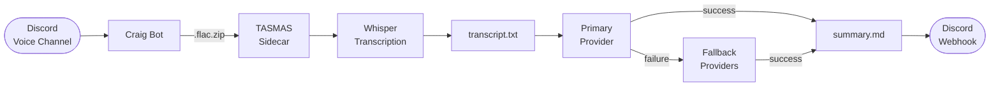

# Craig AI

Record your Discord meetings, get a transcript, and receive an AI-generated summary — all on your own infrastructure, with no data leaving your server.

Built on top of [Craig](https://craig.chat/), the open-source multi-track Discord recorder. Craig AI keeps everything Craig does and layers a fully automated post-processing pipeline on top: local Whisper transcription, a multi-provider AI summarization chain, and directly delivers the meeting summary to Discord.

## Pipeline

## Services

| Service | Stack | Purpose |
|---------|-------|---------|
| `bot` | TypeScript / Eris | Discord bot — joins voice channels, records multi-track audio |
| `dashboard` | Next.js / React | Web UI for account management, cloud storage OAuth |
| `download` | Fastify (8 instances) | Recording download server |
| `tasks` | Node.js / Winston | Background jobs — cloud uploads, expiry cleanup, format conversion |
| `tasmas` | Python / Docker-in-Docker | Transcription & summarization sidecar (Whisper + AI) |

## Documentation

- [Architecture overview](docs/architecture.md)
- [AI summarization & fallback chain](docs/ai-summarization.md)
- [TASMAS transcription sidecar](docs/tasmas.md)
- [Self-hosting guide](docs/self-hosting.md)
- [Useful commands](docs/useful-commands.md)

## Quick start

See the [self-hosting guide](docs/self-hosting.md) for full setup instructions, or the original [SELFHOST.md](SELFHOST.md) for bare-metal installation.
