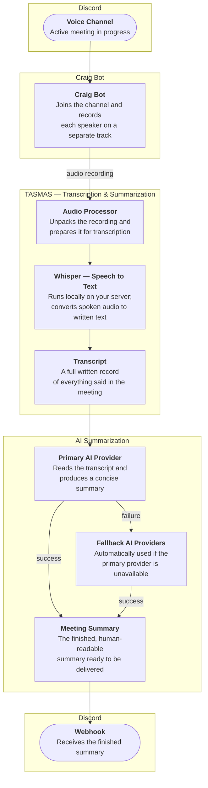

# Craig AI

Craig AI automatically records your team's Discord voice meetings, converts the audio to a written transcript, and delivers a clear AI-generated summary — all running on your own server so your conversations never leave your infrastructure.

It's built on top of [Craig](https://craig.chat/), an open-source Discord recording bot, and adds a fully automated pipeline on top: audio is transcribed locally, summarized by an AI provider, and the finished summary is posted back to Discord.

## How it works

1. **Record** — the Craig bot joins a Discord voice channel and captures the meeting audio.
2. **Transcribe** — audio is converted to text on your own server using Whisper, an open-source speech-to-text model.
3. **Summarize** — the transcript is sent to an AI provider (with automatic fallback to a backup provider if needed) to produce a concise written summary.
4. **Deliver** — the summary is posted directly to a Discord channel via webhook.

## Components

| Component | What it does |
|-----------|--------------|
| Bot | Joins Discord voice channels and records meeting audio |
| Dashboard | Web interface for managing accounts and connected cloud storage |
| Download server | Lets users retrieve their raw recordings |
| Task runner | Handles background work — uploading to cloud storage, cleaning up old files, converting audio formats |
| Transcription & summarization | Converts audio to text and generates the AI summary |

## Documentation

- [Production setup](docs/self-hosting.md)
- [Development setup](docs/development.md)
- [Architecture overview](docs/architecture.md)
- [AI summarization & fallback chain](docs/ai-summarization.md)
- [Transcription sidecar](docs/tasmas.md)
- [Useful commands](docs/useful-commands.md)
